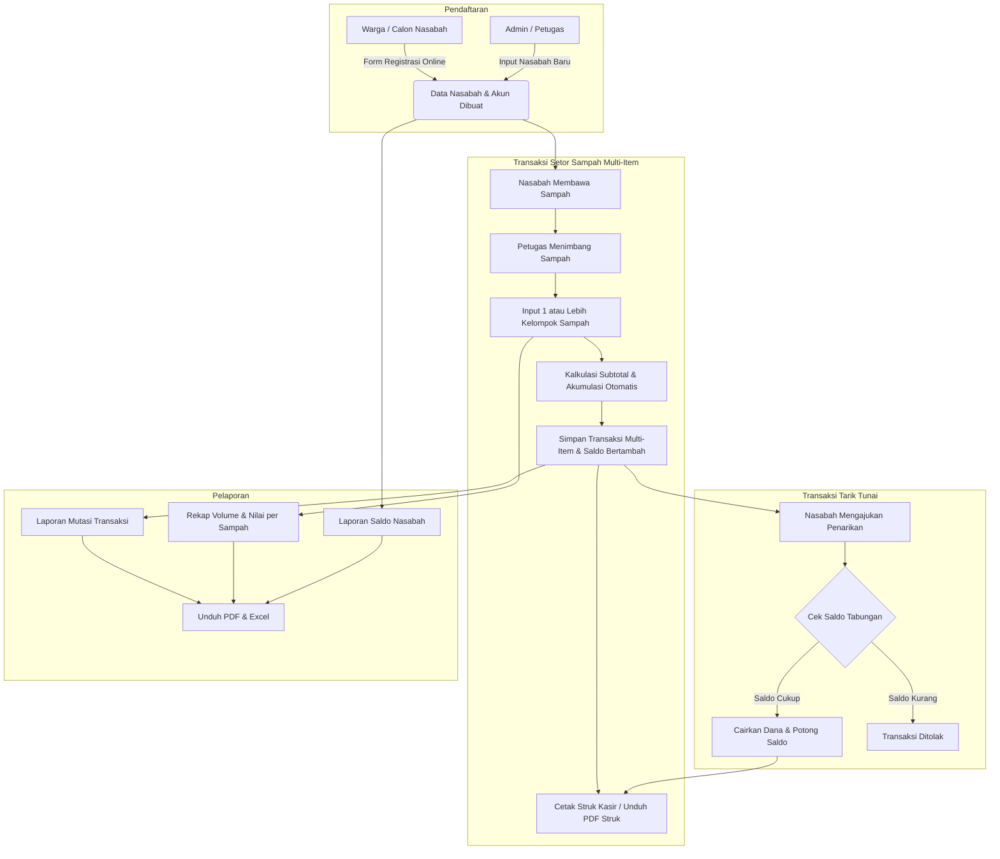

# 🌿 Sistem Operasional Tabungan Bank Sampah Unit (BSU) Villa Harmonis

Aplikasi web modern dan terpadu untuk pengelolaan operasional **Bank Sampah Unit (BSU) Villa Harmonis**. Sistem ini memfasilitasi pencatatan transaksi tabungan sampah (Setor Sampah Multi-Item & Tarik Tunai), manajemen data nasabah lengkap, katalog harga sampah dinamis, manajemen pengguna berbasis peran (*Role-Based Access Control*), pencetakan bukti transaksi resmi (struk kasir ramah printer thermal & format A5), serta ekspor laporan terperinci dalam format **PDF** dan **Excel**.

---

## 📑 Daftar Isi
- [Fitur Utama](#-fitur-utama)
- [Teknologi & Arsitektur](#-teknologi--arsitektur)
- [Struktur Proyek](#-struktur-proyek)
- [Panduan Instalasi & Menjalankan Aplikasi](#-panduan-instalasi--menjalankan-aplikasi)
- [Akun Pengguna Default (Awal)](#-akun-pengguna-default-awal)
- [Alur Operasional Sistem](#-alur-operasional-sistem)
- [Dokumentasi API & Pengujian](#-dokumentasi-api--pengujian)
- [Konfigurasi Lingkungan (.env)](#-konfigurasi-lingkungan-env)

---

## ✨ Fitur Utama

### 1. 👥 Sistem Role & Manajemen Pengguna (RBAC)
- **Role Admin / Petugas Admin:**
  - Akses penuh ke seluruh fitur operasional, data master, transaksi, dan laporan.
  - **Manajemen User / Petugas**: Menambah, mengaktifkan/menonaktifkan, dan mengatur hak akses akun petugas/admin.
  - **Manajemen Nasabah Terpadu**:
    - Pendaftaran nasabah baru (dengan validasi NIK 16 digit dan RT/RW fleksibel 1-3 digit).
    - Ringkasan metrik statistik (*Total Nasabah*, *Nasabah Aktif*, *Nasabah Nonaktif*, dan *Total Saldo Tabungan*).
    - Pencarian cepat komprehensif (Nama, NIK, ID/Rekening, No. HP, Alamat, RT/RW) dengan filter kategori nasabah dan status akun.
    - Verifikasi data, edit profil, pintasan langsung setor sampah, dan toggle aktif/nonaktif akun.
- **Role Nasabah (Portal Nasabah Mandiri):**
  - **Dashboard Mandiri**: Ringkasan saldo tabungan terkini, agregasi total berat sampah yang disetorkan (dalam kilogram per kategori), dan total transaksi.
  - **Riwayat Tabungan**: Melihat mutasi tabungan debit/kredit dan mengunduh bukti transaksi (struk digital PDF).
  - **Katalog Harga Sampah**: Daftar kelompok sampah dan harga per kg yang sedang berlaku aktif.
  - **Profil & Pengaturan Akun**: Edit data diri mandiri (Nama, No. KTP/NIK, No. HP, Alamat, RT/RW/Kelurahan/Kecamatan/Kota) dan ubah password akun.

### 2. 📝 Registrasi Nasabah Baru
- Pendaftaran mandiri publik maupun oleh petugas admin.
- Validasi data lengkap:
  - NIK (16 digit angka dengan validasi keunikan dan penyimpanan teks yang aman dari integer overflow).
  - Kategori Nasabah: **Rumah Tangga/Individu**, **Sekolah**, atau **Instansi**.
  - No. HP, Alamat Lengkap, RT (1-3 digit), RW (1-3 digit), Kelurahan, Kecamatan, dan Kabupaten/Kota.
- Checkbox persetujuan **Syarat & Pernyataan** wajib disetujui sebelum pendaftaran dapat diproses.
- Akun login nasabah otomatis aktif dan langsung dapat digunakan.

### 3. 💰 Catat Transaksi Tabungan Cerdas & Multi-Item
- **Setor Sampah (Multi-Item Waste Deposit):**
  - Pemilihan nasabah aktif dengan **autocomplete search suggestions**.
  - **Dukungan Banyak Jenis Sampah Sekaligus**: Petugas dapat menambahkan lebih dari 1 kelompok sampah berbeda dalam satu transaksi setor (dinamis tambah/hapus baris item).
  - Kalkulasi subtotal otomatis per kelompok sampah (`Berat (kg) × Harga/kg`) serta akumulasi total berat dan total rupiah setoran secara seketika (*real-time*).
  - Penambahan saldo seketika secara atomik (*atomic ACID transaction*) dengan penyimpanan rincian pada tabel `transaction_items`.
- **Tarik Tunai Tabungan:**
  - Validasi otomatis ketersediaan saldo nasabah guna mencegah saldo tabungan bernilai negatif (*balance guard*).
  - Pemotongan saldo dan pencatatan riwayat debit secara atomik.
- **Penerbitan Bukti Transaksi Resmi (Struk Kasir & PDF):**
  - Halaman bukti transaksi dengan tata letak struk kasir modern menampilkan rincian tabel multi-item barang dan identitas petugas kasir (`Kasir / Petugas`).
  - Siap cetak langsung (*browser print*) dengan optimalisasi printer thermal maupun format A5 (@media print responsif).
  - Ekspor dan unduh berkas digital format **PDF A5** dengan text-wrapping rapi.

### 4. 🏷️ Master Kategori & Harga Sampah Dinamis
- Manajemen kelompok sampah (Plastik, Kertas, Logam/Besi, Kaca, Minyak Jelantah, dll).
- Penetapan harga per kg dengan tanggal berlaku efektif (*effective date*) dan audit trail perubahan harga.
- Riwayat perubahan harga sampah tanpa merusak histori transaksi terdahulu.

### 5. 📊 Pelaporan & Ekspor Data (PDF & Excel)
- **Laporan Transaksi Tabungan**: Filter periode tanggal, jenis transaksi (Setor/Tarik), kelompok sampah, atau nasabah tertentu (Export Excel & PDF Landscape A4).
- **Rekapitulasi Setoran per Kelompok Sampah**: Analisis volume (kg) dan perputaran rupiah per jenis sampah terintegrasi dengan tabel rincian `transaction_items` (Export Excel & PDF Portrait A4).
- **Laporan Daftar Nasabah & Saldo**: Rekap seluruh nasabah dan total kewajiban saldo tabungan (Export Excel & PDF Portrait A4).
- **Laporan Master Harga Sampah**: Daftar tarif kelompok sampah terkini (Export Excel & PDF Portrait A4).
- **Tata Letak & Keamanan Ekspor**: Semua sel tabel dibungkus rapi dengan PDFKit serta proteksi formula injection pada spreadsheet ExcelJS.

---

## 🛠 Teknologi & Arsitektur

### Backend
- **Framework**: [Hono v4](https://hono.dev/) Web Application Framework + [Node.js](https://nodejs.org/) (TypeScript)
- **Database**: SQLite3 lokal (`backend/bsuvh.db`) / [Turso LibSQL](https://turso.tech/) via `@libsql/client`
- **Validasi Data**: [Zod](https://zod.dev/) + `@hono/zod-validator`
- **Autentikasi & Keamanan**: JWT (*JSON Web Tokens*) via `jsonwebtoken` + Bcrypt Password Hashing (`bcryptjs`)
- **Dokumen Generator**: [PDFKit](https://pdfkit.org/) (PDF Generation Struk & Laporan) & [ExcelJS](https://github.com/exceljs/exceljs) (Excel Operational Report)
- **Testing**: [Vitest](https://vitest.dev/) (7 test files, 41 skenario pengujian otomatis, 100% lulus)

### Frontend
- **Framework**: [React 18](https://react.dev/) + [Vite](https://vitejs.dev/)
- **Styling**: [Tailwind CSS v3](https://tailwindcss.com/)
- **Routing**: [React Router DOM v6](https://reactrouter.com/) (Protected Routes & Role Guards)
- **State Management**: [Zustand](https://github.com/pmndrs/zustand)
- **Data Fetching & Cache**: [TanStack React Query v5](https://tanstack.com/query/latest)
- **Form Handling & Validasi**: [React Hook Form](https://react-hook-form.com/) + [Zod](https://zod.dev/)
- **Icons**: [Lucide React](https://lucide.dev/)

---

## 📁 Struktur Proyek

```text
bsuvillaharmonis/
├── backend/                        # Backend REST API (Hono / TypeScript)
│   ├── src/
│   │   ├── core/                   # Config, LibSQL database client, security
│   │   ├── db/                     # Migrations DDL (transaction_items auto-backfill), seed
│   │   ├── middleware/             # JWT auth, role guard, rate limiter, error handler
│   │   ├── routes/                 # Hono route handlers (auth, transactions, nasabah, reports, master)
│   │   ├── schemas/                # Skema validasi Zod terpusat
│   │   ├── services/               # Logika bisnis (transaksi multi-item atomik, guard saldo, struk kasir, excel)
│   │   ├── types/                  # Typed Hono Env & model interfaces
│   │   ├── utils/                  # Currency, formatting, standard response
│   │   └── index.ts                # Server entry point
│   ├── tests/                      # Automated unit & integration tests (Vitest - 41 tests)
│   ├── bsuvh.db                    # Database SQLite3 lokal
│   ├── package.json                # Dependensi backend & scripts
│   └── .env                        # Konfigurasi environment backend
│
├── frontend/                       # Frontend Web App (React + Vite)
│   ├── src/
│   │   ├── components/             # Komponen UI umum (Button, Modal, Table, Sidebar, dll)
│   │   ├── features/               # Halaman & fitur (auth, dashboard, transaksi multi-item, nasabah, reports, receipt)
│   │   ├── routes/                 # Konfigurasi rute (AppRoutes, ProtectedRoute, RoleGuard)
│   │   ├── services/               # Klien Axios API services
│   │   └── stores/                 # State management auth & UI (Zustand)
│   ├── package.json                # Dependensi frontend & scripts
│   └── vite.config.js              # Konfigurasi Vite
│
├── start.sh                        # Script praktis menjalankan Backend & Frontend sekaligus
└── README.md                       # Dokumentasi sistem
```

---

## 🚀 Panduan Instalasi & Menjalankan Aplikasi

### Prasyarat Sistem
- **Node.js**: Versi 20 atau lebih baru (`node --version`)
- **NPM**: Versi 9 atau lebih baru (`npm --version`)

---

### Cara Praktis (Menjalankan Sekaligus)

Gunakan script `start.sh` di root direktori untuk menyalakan backend dan frontend secara bersamaan:

```bash
chmod +x start.sh
./start.sh
```

---

### Cara Manual (Menjalankan Terpisah)

#### 1. Menjalankan Backend (Hono / TypeScript)

```bash
# 1. Masuk ke folder backend
cd backend

# 2. Install dependensi
npm install

# 3. Salin file environment jika belum ada
cp .env.example .env

# 4. Jalankan server backend development
npm run dev
```
> Server backend berjalan di: `http://localhost:8000`

#### 2. Menjalankan Frontend (React + Vite)

Buka terminal baru:

```bash
# 1. Masuk ke folder frontend
cd frontend

# 2. Install dependensi NPM
npm install

# 3. Jalankan server development Vite
npm run dev
```
> Aplikasi frontend berjalan di: `http://localhost:5173`

---

## 🔑 Akun Pengguna Default (Awal)

Saat database diinisialisasi pertama kali, sistem telah menyediakan akun admin bawaan:

| Role | Username / Identifier | Password | Deskripsi |
| :--- | :--- | :--- | :--- |
| **ADMIN** | `admin` | `AdminPassword123!` | Akun Administrator / Petugas Utama |

> 💡 **Akun Nasabah**: Nasabah dapat mendaftar langsung melalui menu **Daftar Nasabah Baru** di halaman login publik atau didaftarkan oleh Admin. Username login nasabah menggunakan **ID Nasabah / No. Rekening** (misal: `bsuvh0001`) atau **No. KTP/NIK**, dengan password yang dibuat saat pendaftaran.

---

## 🔄 Alur Operasional Sistem



---

## 🧪 Dokumentasi API & Pengujian

### Arsitektur REST API (Hono)
Backend Hono berjalan di port `http://localhost:8000` dengan arsitektur RESTful terstandarisasi, validasi schema Zod, dan respon seragam (`success`, `message`, `data`, `error_code`):
- **Health Check & Info**: `GET /health`, `GET /`
- **Autentikasi & Profil**: `POST /api/v1/auth/login`, `POST /api/v1/auth/register`, `GET /api/v1/auth/me`, `POST /api/v1/auth/change-password`
- **Manajemen Transaksi Multi-Item**: `GET /api/v1/admin/transactions`, `POST /api/v1/admin/transactions` (dukungan payload `items: [...]`), `GET /api/v1/admin/transactions/:id`, `GET /api/v1/admin/transactions/:id/receipt` (Struk Kasir & PDF)
- **Manajemen Nasabah**: `GET /api/v1/admin/nasabah` (lengkap dengan metrik statistik), `POST /api/v1/admin/nasabah`, `GET /api/v1/admin/nasabah/:id`, `PUT /api/v1/admin/nasabah/:id`, `PATCH /api/v1/admin/nasabah/:id/status`
- **Portal Mandiri Nasabah**: `/api/v1/me/nasabah`, `/api/v1/me/balance`, `/api/v1/me/transactions`
- **Master Data**: `/api/v1/admin/master/categories`, `/api/v1/admin/master/waste-prices`, `/api/v1/admin/users`
- **Laporan & Ekspor**: `/api/v1/admin/reports/transactions`, `/api/v1/admin/reports/category-recap`, `/api/v1/admin/reports/nasabah-balances`, `/api/v1/admin/reports/waste-prices` (Format PDF & Excel)

### Menjalankan Automated Test Suite
Backend dilengkapi dengan unit & integration testing otomatis menggunakan **Vitest** untuk menjamin keandalan sistem autentikasi, transaksi multi-item, akurasi saldo atomik, dan keamanan:

```bash
cd backend
npm test
```
*(Hasil pengujian saat ini: 7 test files, 41 automated test cases, 100% lulus).*

---

## ⚙️ Konfigurasi Lingkungan (.env)

Contoh konfigurasi file `backend/.env`:

```env
APP_NAME="BSU Villa Harmonis"
APP_ENV=development
APP_SECRET_KEY=supersecretkeyforbsuvillaharmonis2026changethisinprod
JWT_ALGORITHM=HS256
ACCESS_TOKEN_EXPIRE_MINUTES=1440
REFRESH_TOKEN_EXPIRE_DAYS=7
CORS_ORIGINS=["http://localhost:3000","http://localhost:5173","http://localhost:8000","http://127.0.0.1:3000","http://127.0.0.1:5173"]
BANK_NAME="BSU Villa Harmonis"
RECEIPT_FOOTER="Terima kasih telah menjaga lingkungan bersama Bank Sampah Unit Villa Harmonis."

# Opsional: Jika ingin menggunakan Cloud Database Turso LibSQL
DATABASE_URL=
TURSO_AUTH_TOKEN=
```
*(Catatan: Jika `DATABASE_URL` dikosongkan, backend secara otomatis menggunakan database SQLite3 lokal `backend/bsuvh.db`).*

---

## 🛡 Lisensi & Kontributor
Sistem Operasional Bank Sampah Unit (BSU) Villa Harmonis dikembangkan untuk mendukung pengelolaan lingkungan berkelanjutan dan digitalisasi bank sampah warga.
