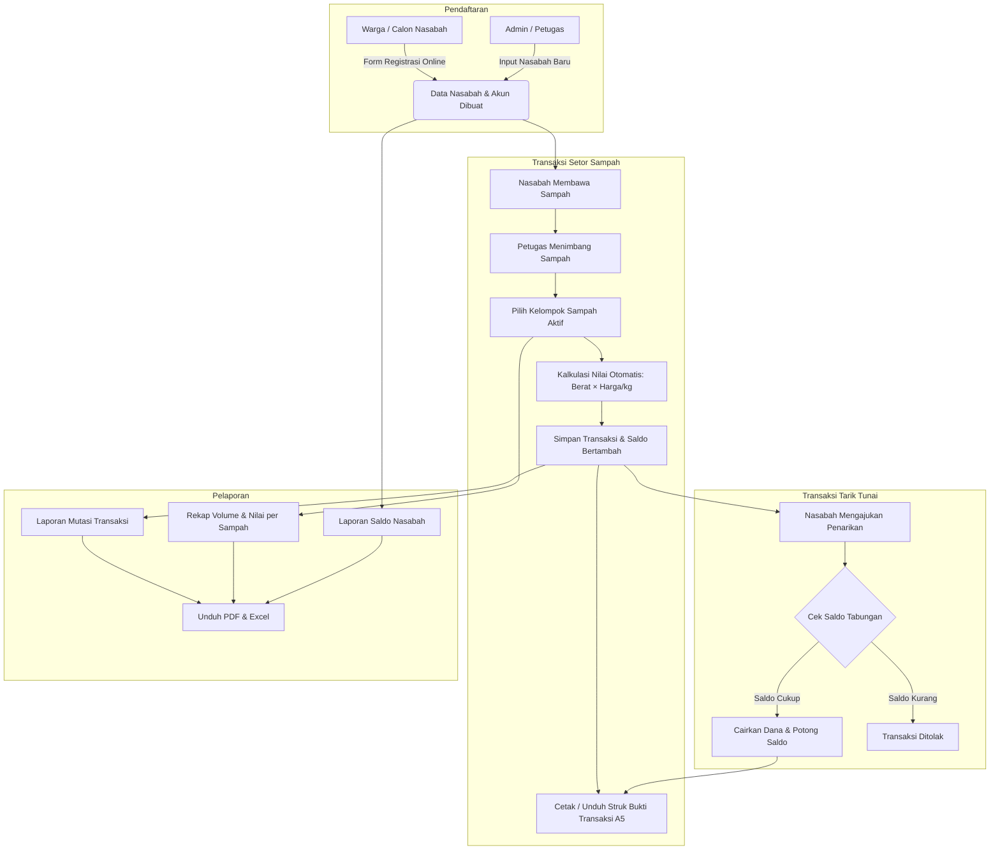

# 🌿 Sistem Operasional Tabungan Bank Sampah Unit (BSU) Villa Harmonis

Aplikasi web modern dan terpadu untuk pengelolaan operasional **Bank Sampah Unit (BSU) Villa Harmonis**. Sistem ini memfasilitasi pencatatan transaksi tabungan sampah (Setor Sampah & Tarik Tunai), manajemen data nasabah, katalog harga sampah dinamis, manajemen pengguna berbasis peran (*Role-Based Access Control*), pencetakan bukti transaksi (struk A5), serta ekspor laporan terperinci dalam format **PDF** dan **Excel**.

---

## 📑 Daftar Isi
- [Fitur Utama](#-fitur-utama)
- [Teknologi & Arsitektur](#-teknologi--arsitektur)
- [Struktur Proyek](#-struktur-proyek)
- [Panduan Instalasi & Menjalankan Aplikasi](#-panduan-instalasi--menjalankan-aplikasi)
- [Akun Pengguna Default (Awal)](#-akun-pengguna-default-awal)
- [Alur Operasional Sistem](#-alur-operasional-sistem)
- [Dokumentasi API & Pengujian](#-dokumentasi-api--pengujian)
- [Konfigurasi Lingkungan (.env)](#-konfigurasi-lingkungan-env)

---

## ✨ Fitur Utama

### 1. 👥 Sistem Role & Manajemen Pengguna (RBAC)
- **Role Admin / Petugas Admin:**
  - Akses penuh ke seluruh fitur operasional, data master, transaksi, dan laporan.
  - **Manajemen User / Petugas**: Menambah, mengaktifkan/menonaktifkan, dan mengatur hak akses akun petugas/admin.
  - **Manajemen Nasabah**: Pendaftaran nasabah baru, verifikasi data, edit profil nasabah, dan penonaktifan akun.
- **Role Nasabah (Portal Nasabah Mandiri):**
  - **Dashboard Mandiri**: Ringkasan saldo tabungan terkini, total berat sampah yang disetorkan, dan total transaksi.
  - **Riwayat Tabungan**: Melihat mutasi tabungan debit/kredit dan mengunduh bukti transaksi (struk PDF).
  - **Katalog Harga Sampah**: Daftar kelompok sampah dan harga per kg yang sedang berlaku aktif.
  - **Profil & Pengaturan Akun**: Edit data diri mandiri (Nama, No. KTP/NIK, No. HP, Alamat, RT/RW/Kelurahan/Kecamatan/Kota) dan ubah password akun.

### 2. 📝 Registrasi Nasabah Baru
- Pendaftaran mandiri publik maupun oleh petugas admin.
- Validasi data lengkap:
  - NIK (16 digit angka dengan validasi keunikan).
  - Kategori Nasabah: **Rumah Tangga/Individu**, **Sekolah**, atau **Instansi**.
  - No. HP, Alamat Lengkap, RT, RW, Kelurahan, Kecamatan, dan Kabupaten/Kota.
- Checkbox persetujuan **Syarat & Pernyataan** wajib disetujui sebelum pendaftaran dapat diproses.
- Akun login nasabah otomatis aktif dan langsung dapat digunakan.

### 3. 💰 Catat Transaksi Tabungan Cerdas
- **Setor Sampah:**
  - Pemilihan nasabah aktif dengan **autocomplete search suggestions**.
  - Pemilihan kelompok sampah aktif dengan **autocomplete search suggestions** (query otomatis ke data master harga aktif).
  - Kalkulasi otomatis total nilai setoran (`Berat (kg) × Harga/kg`).
  - Penambahan saldo seketika (*atomic ACID transaction*).
- **Tarik Tunai Tabungan:**
  - Validasi otomatis ketersediaan saldo nasabah.
  - Pemotongan saldo dan pencatatan riwayat debit.
- **Penerbitan Bukti Transaksi (Struk):**
  - Struk transaksi siap cetak dan ekspor format **PDF A5** dengan text-wrapping rapi.

### 4. 🏷️ Master Kategori & Harga Sampah Dinamis
- Manajemen kelompok sampah (Plastik, Kertas, Logam/Besi, Kaca, Minyak Jelantah, dll).
- Penetapan harga per kg dengan tanggal berlaku efektif (*effective date*).
- Riwayat perubahan harga sampah tanpa merusak histori transaksi terdahulu.

### 5. 📊 Pelaporan & Ekspor Data (PDF & Excel)
- **Laporan Transaksi Tabungan**: Filter periode tanggal, jenis transaksi (Setor/Tarik), kelompok sampah, atau nasabah tertentu (Export Excel & PDF Landscape A4).
- **Rekapitulasi Setoran per Kelompok Sampah**: Analisis volume (kg) dan perputaran rupiah per jenis sampah (Export Excel & PDF Portrait A4).
- **Laporan Daftar Nasabah & Saldo**: Rekap seluruh nasabah dan total kewajiban saldo tabungan (Export Excel & PDF Portrait A4).
- **Laporan Master Harga Sampah**: Daftar tarif kelompok sampah terkini (Export Excel & PDF Portrait A4).
- **Text Wrapping (`wrap`) Otomatis**: Semua sel tabel ReportLab dibungkus `Paragraph` agar teks panjang tidak terpotong.

---

## 🛠 Teknologi & Arsitektur

### Backend
- **Framework**: [Python 3.10+](https://www.python.org/) + [FastAPI](https://fastapi.tiangolo.com/) (Asynchronous High-Performance API)
- **Database**: SQLite3 lokal (`backend/bsuvh.db`) / [Turso LibSQL](https://turso.tech/) Cloud Database
- **Validasi Data**: [Pydantic v2](https://docs.pydantic.dev/) + Pydantic Settings
- **Autentikasi & Keamanan**: JWT (*JSON Web Tokens*) via PyJWT + Bcrypt Password Hashing
- **Dokumen Generator**: [ReportLab](https://www.reportlab.com/) (PDF Generation) & [OpenPyXL](https://openpyxl.readthedocs.io/) (Excel Generation)
- **Testing**: [Pytest](https://docs.pytest.org/)

### Frontend
- **Framework**: [React 18](https://react.dev/) + [Vite](https://vitejs.dev/)
- **Styling**: [Tailwind CSS v3](https://tailwindcss.com/)
- **Routing**: [React Router DOM v6](https://reactrouter.com/) (Protected Routes & Role Guards)
- **State Management**: [Zustand](https://github.com/pmndrs/zustand)
- **Data Fetching & Cache**: [TanStack React Query v5](https://tanstack.com/query/latest)
- **Form Handling & Validasi**: [React Hook Form](https://react-hook-form.com/) + [Zod](https://zod.dev/)
- **Icons**: [Lucide React](https://lucide.dev/)

---

## 📁 Struktur Proyek

```text
bsuvillaharmonis/
├── backend/                        # Backend REST API (FastAPI)
│   ├── app/
│   │   ├── api/v1/                 # Endpoint REST API (auth, transactions, nasabah, reports, dll)
│   │   ├── core/                   # Konfigurasi app, security, dan database connector
│   │   ├── models/                 # Definisi skema dan model database
│   │   ├── schemas/                # Skema request & response Pydantic
│   │   ├── services/               # Logika bisnis (auth, transaksi, laporan, struk, nasabah)
│   │   └── utils/                  # Helper format uang, tanggal, dan berat
│   ├── tests/                      # Automated unit & integration tests (Pytest)
│   ├── bsuvh.db                    # Database SQLite3
│   ├── requirements.txt            # Dependensi Python
│   └── .env                        # Konfigurasi environment backend
│
├── frontend/                       # Frontend Web App (React + Vite)
│   ├── src/
│   │   ├── components/             # Komponen UI umum (Button, Modal, Table, Sidebar, dll)
│   │   ├── features/               # Halaman & fitur (auth, dashboard, transaksi, nasabah, reports)
│   │   ├── routes/                 # Konfigurasi rute (AppRoutes, ProtectedRoute, RoleGuard)
│   │   ├── services/               # Klien Axios API services
│   │   └── stores/                 # State management auth (Zustand)
│   ├── package.json                # Dependensi frontend & scripts
│   └── vite.config.js              # Konfigurasi Vite
│
├── start.sh                        # Script praktis menjalankan Backend & Frontend sekaligus
└── README.md                       # Dokumentasi sistem
```

---

## 🚀 Panduan Instalasi & Menjalankan Aplikasi

### Prasyarat Sistem
- **Python**: Versi 3.10 atau lebih baru (`python3 --version`)
- **Node.js**: Versi 18 atau lebih baru (`node --version`)
- **NPM**: Versi 9 atau lebih baru (`npm --version`)

---

### Cara Praktis (Menjalankan Sekaligus)

Gunakan script `start.sh` di root direktori untuk menyalakan backend dan frontend secara bersamaan:

```bash
chmod +x start.sh
./start.sh
```

---

### Cara Manual (Menjalankan Terpisah)

#### 1. Menjalankan Backend (FastAPI)

```bash
# 1. Masuk ke folder backend
cd backend

# 2. Buat & aktifkan virtual environment (jika belum ada)
python3 -m venv venv
source venv/bin/activate

# 3. Install dependensi
pip install -r requirements.txt

# 4. Salin file environment jika belum ada
cp .env.example .env

# 5. Jalankan server backend
uvicorn app.main:app --host 0.0.0.0 --port 8000 --reload
```
> Server backend berjalan di: `http://localhost:8000`

#### 2. Menjalankan Frontend (React + Vite)

Buka terminal baru:

```bash
# 1. Masuk ke folder frontend
cd frontend

# 2. Install dependensi NPM
npm install

# 3. Jalankan server development Vite
npm run dev
```
> Aplikasi frontend berjalan di: `http://localhost:5173`

---

## 🔑 Akun Pengguna Default (Awal)

Saat database diinisialisasi pertama kali, sistem telah menyediakan akun admin bawaan:

| Role | Username / Identifier | Password | Deskripsi |
| :--- | :--- | :--- | :--- |
| **ADMIN** | `admin` | `AdminPassword123!` | Akun Administrator / Petugas Utama |

> 💡 **Akun Nasabah**: Nasabah dapat mendaftar langsung melalui menu **Daftar Nasabah Baru** di halaman login publik atau didaftarkan oleh Admin. Username login nasabah menggunakan **ID Nasabah** (misal: `NVH-0001`) atau **No. KTP/NIK**, dengan password yang dibuat saat pendaftaran.

---

## 🔄 Alur Operasional Sistem



---

## 🧪 Dokumentasi API & Pengujian

### Dokumentasi Interaktif OpenAPI (Swagger)
Ketika backend berjalan, dokumentasi REST API lengkap dan pengujian endpoint langsung (*live testing*) dapat diakses pada:
- **Swagger UI**: [http://localhost:8000/docs](http://localhost:8000/docs)
- **ReDoc**: [http://localhost:8000/redoc](http://localhost:8000/redoc)

### Menjalankan Automated Test Suite
Backend dilengkapi dengan unit testing menggunakan `pytest` untuk menjamin keandalan sistem autentikasi, transaksi perbankan sampah, akurasi mutasi saldo, dan ekspor laporan:

```bash
cd backend
source venv/bin/activate
pytest -v
```

---

## ⚙️ Konfigurasi Lingkungan (.env)

Contoh konfigurasi file `backend/.env`:

```env
APP_NAME="BSU Villa Harmonis"
APP_ENV=development
APP_SECRET_KEY=supersecretkeyforbsuvillaharmonis2026changethisinprod
JWT_ALGORITHM=HS256
ACCESS_TOKEN_EXPIRE_MINUTES=1440
REFRESH_TOKEN_EXPIRE_DAYS=7
CORS_ORIGINS=["http://localhost:3000","http://localhost:5173","http://localhost:8000","http://127.0.0.1:3000","http://127.0.0.1:5173"]
BANK_NAME="BSU Villa Harmonis"
RECEIPT_FOOTER="Terima kasih telah menjaga lingkungan bersama Bank Sampah Unit Villa Harmonis."

# Opsional: Jika ingin menggunakan Cloud Database Turso LibSQL
DATABASE_URL=
TURSO_AUTH_TOKEN=
```
*(Catatan: Jika `DATABASE_URL` dikosongkan, backend secara otomatis menggunakan database SQLite3 lokal `backend/bsuvh.db`).*

---

## 🛡 Lisensi & Kontributor
Sistem Operasional Bank Sampah Unit (BSU) Villa Harmonis dikembangkan untuk mendukung pengelolaan lingkungan berkelanjutan dan digitalisasi bank sampah warga.
